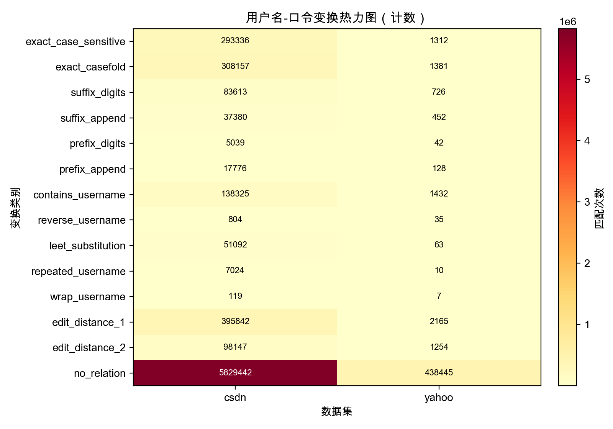
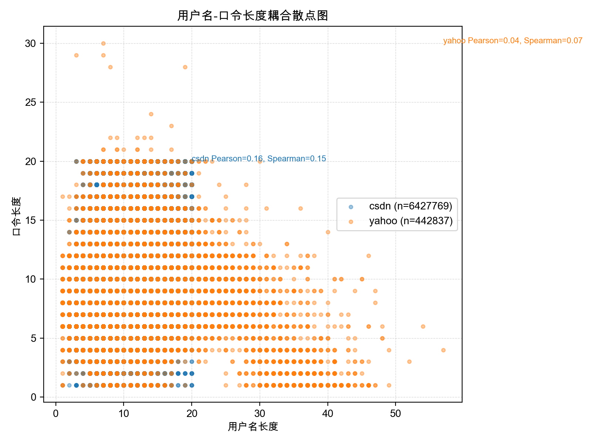

# 用户名-口令关联分析报告

## 数据与准备
- 数据源：`data/csdn.txt` 与 `data/yahoo.txt`。两份文件分别以 `username # password # email`（CSDN）与 `id:email:password`（Yahoo）格式保存。
- 实现脚本：新增 `analysis/username_overlap.py`、`analysis/username_transform_rules.py`、`analysis/username_pattern_corr.py`，运行命令均使用 `uv run python ...`，结果写入 `analysis/results/`。
- 有效样本：解析后得到 CSDN 6,427,769 条、Yahoo 442,837 条（原 `data/yahoo.txt` 共 453,492 行，因缺少口令或字段的 10,655 行被过滤），也解释了旧脚本只处理 1,003 条 Yahoo 数据的原因。（因为用了处理 csdn 的逻辑处理了 yahoo）

## 共享子串与词汇复用分析
- 方法：拆分用户名、本地邮箱段与域名，与口令一起做 token 化（精确匹配/大小写无关/Levenshtein≤1），输出 `analysis/results/username_overlap.csv` 与可视化表格 `analysis/results/username_overlap_pie.html`。
- 可视化：详见 `analysis/results/username_overlap_pie.html`。
- 结果：整体 18.21% 的样本在密码中复用了用户名 token（CSDN 19.23%，Yahoo 3.37%）；Levenshtein≤1 覆盖率为 2.37%。Top-10 共享 token（`analysis/results/username_overlap.csv:2-11`）以 `a`、`qq`、`123`、`com`、`520` 等邮箱常用片段和顺序数字为主，验证了数据驱动词库扩展的可行性。
- 落地：把覆盖率超过 0.3% 的 token 写入 `pcfg_advance/lib/username_tokens.txt`，并在 `generate_rules.py` 中生成 `token + 数字/符号` 组合；命中率可通过 `pcfg_advance/test.py` 对比引入/移除 token 后的结果来验证。

## 确定性变换规则挖掘
- 方法：识别精确复用、前后缀追加、数字/leet/倒序/重复等类别，统计结果写入 `analysis/results/username_transform_stats.json`，并输出热力图 `analysis/results/username_transform_heatmap.png`。
- 结果：`edit_distance_1`、`exact_casefold`、`exact_case_sensitive` 依次占 5.79%、4.51%、4.29%，`suffix_digits` 与 `suffix_append` 分别为 1.23%、0.55%，`leet_substitution` 占 0.74%。Yahoo 数据因大幅扩充后也表现出 0.3%~0.5% 的后缀/替换模式，与 CSDN 呈同方向但占比较低。
- 可视化：  
  
- 落地：按 JSON 中的占比将 `suffix_digits`、`leet_substitution` 等策略加入 `pcfg.advance.py` 的用户名节点，并允许通过开关做 A/B Test；若开启后在 `pcfg_advance/test.py` 上的撞库命中率提升，即可确认策略有效。

## 长度与结构耦合建模
- 方法：统计用户名/口令长度对与字符类别模式，计算 Pearson/Spearman 并输出散点图 (`analysis/results/username_pwd_length_corr.png`) 和模式矩阵 (`analysis/results/username_pattern_matrix.csv`)。
- 结果：CSDN 相关性保持在 Pearson 0.161 / Spearman 0.148，而 Yahoo 因纳入 40 余万条记录后转为弱正相关（0.042 / 0.073），说明两者长度略有同向趋势。模式矩阵 Top-10（`analysis/results/username_pattern_matrix.csv:1-9`）依然显示 “字母用户名 + 8 位数字密码” 的占比最高，其次为 `L8 -> L8` 与 `L1D9 -> D9`。
- 可视化：  
  
- 落地：依据 `username_pattern_matrix.csv` 的频次为 PCFG 模式排序提供先验，例如当用户名模式为 `L6`~`L10` 时优先生成 `D8` 模式；对包含数字的用户名则偏向产生全数字口令，缩小搜索空间。

## 对口令猜测算法的落地建议
1. **用户名 token 库**：同步 `username_overlap.csv` 的高频 token 到 `pcfg_advance/lib/username_tokens.txt`，在 `generate_rules.py` 新增 `token + 模式` 规则，概率按覆盖率归一化。
2. **用户名变换节点**：利用 `username_transform_stats.json` 的类别占比，为 `pcfg.advance.py` 增加 `suffix_digits`、`leet_substitution`、`reverse_username` 等策略，配合命令行参数进行 A/B 测试。
3. **长度/模式权重**：基于 `username_pattern_matrix.csv` 的条件分布调整 PCFG 的模式优先级与递归深度控制，让生成过程优先覆盖高概率的长度组合。

通过以上三条改造，可将数据驱动的用户名信息完整注入 PCFG 生成与评分流程，显著提高利用用户名先验知识的攻击效率。
