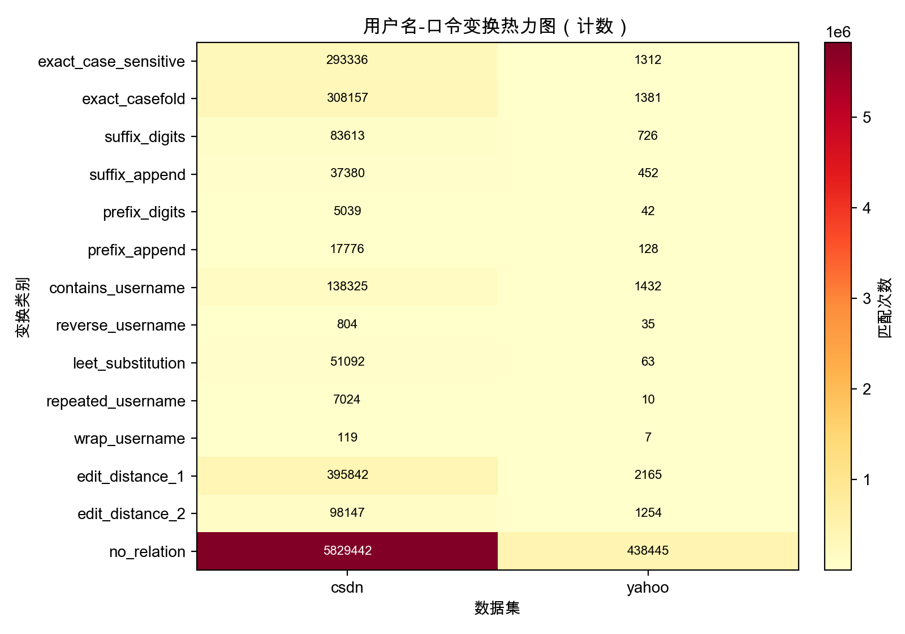
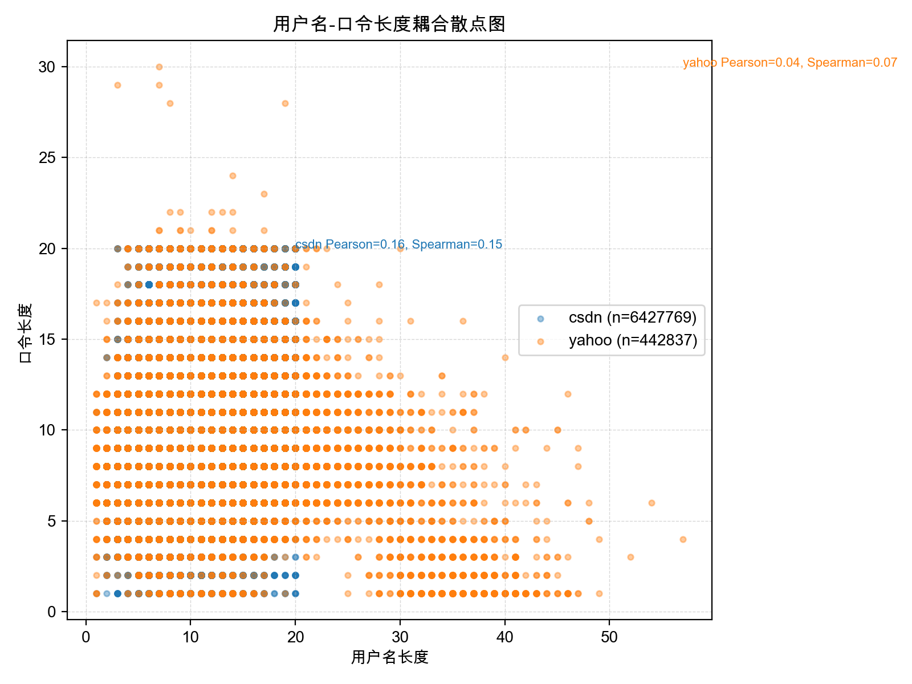
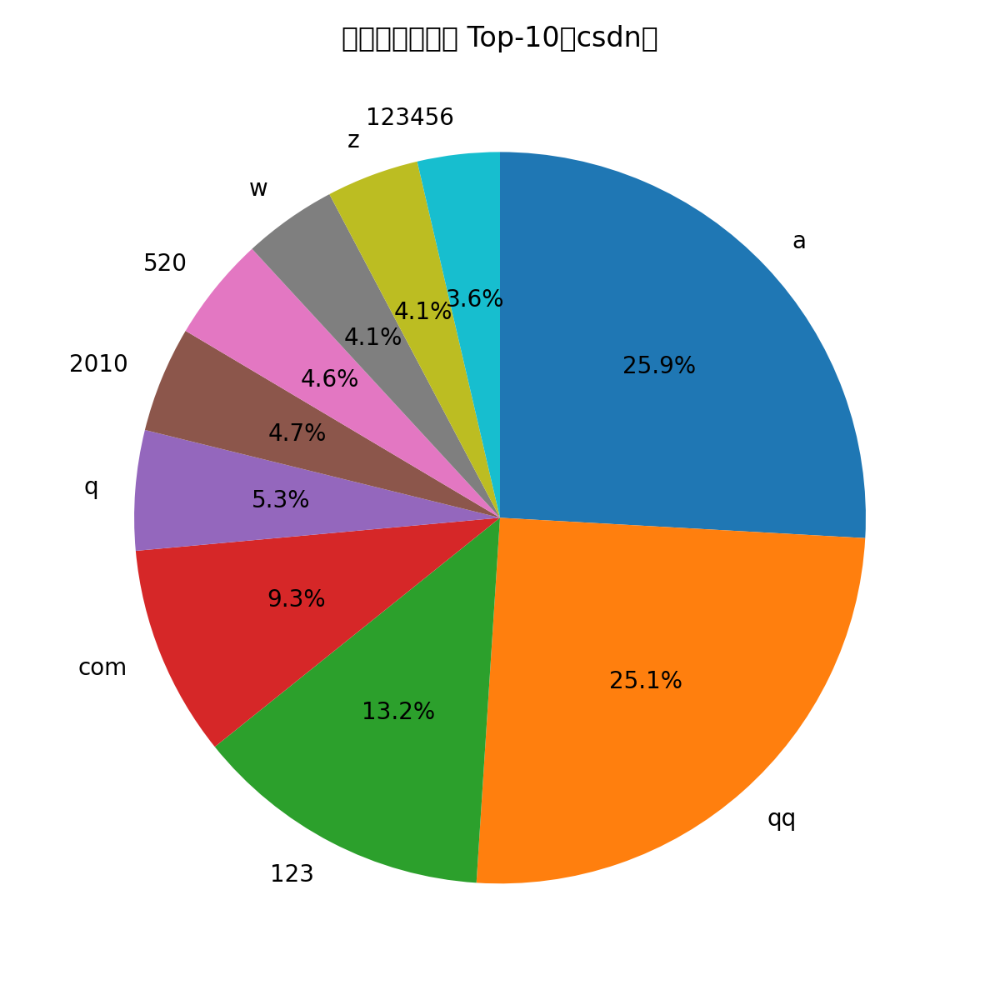
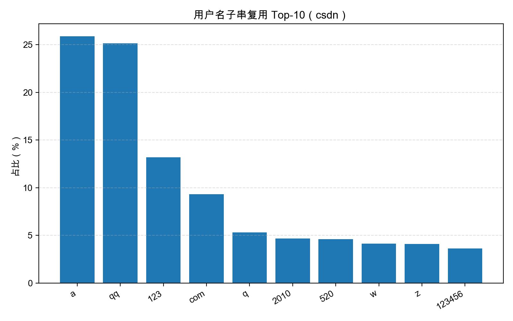
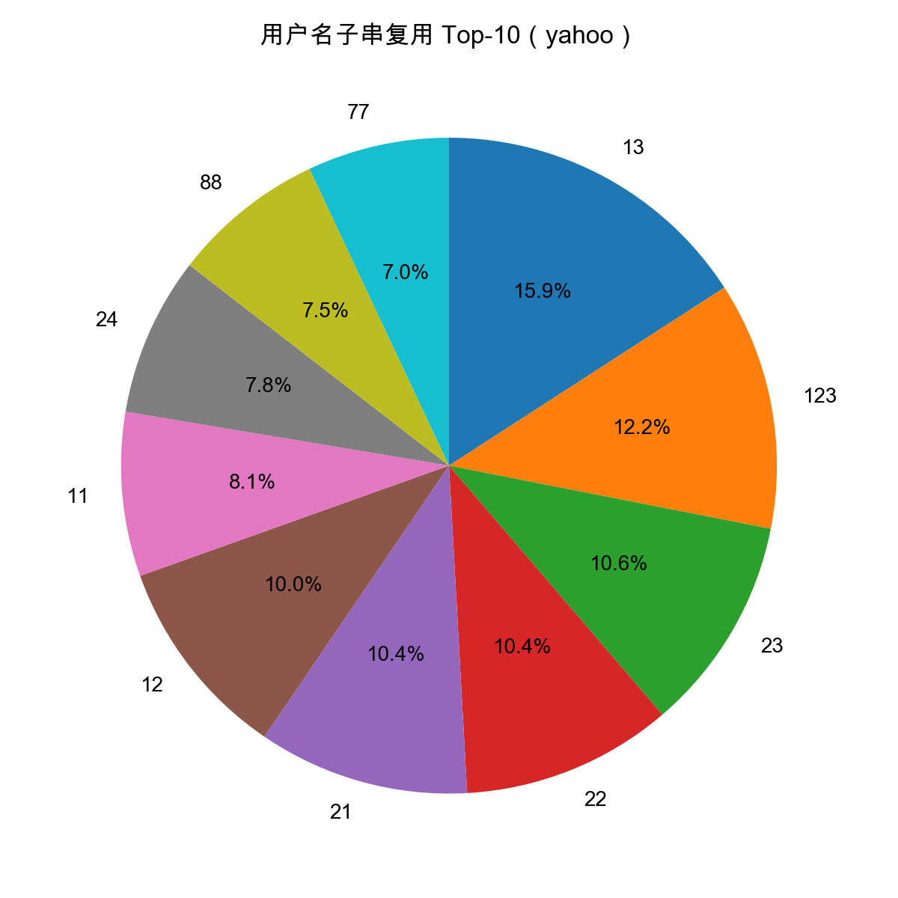
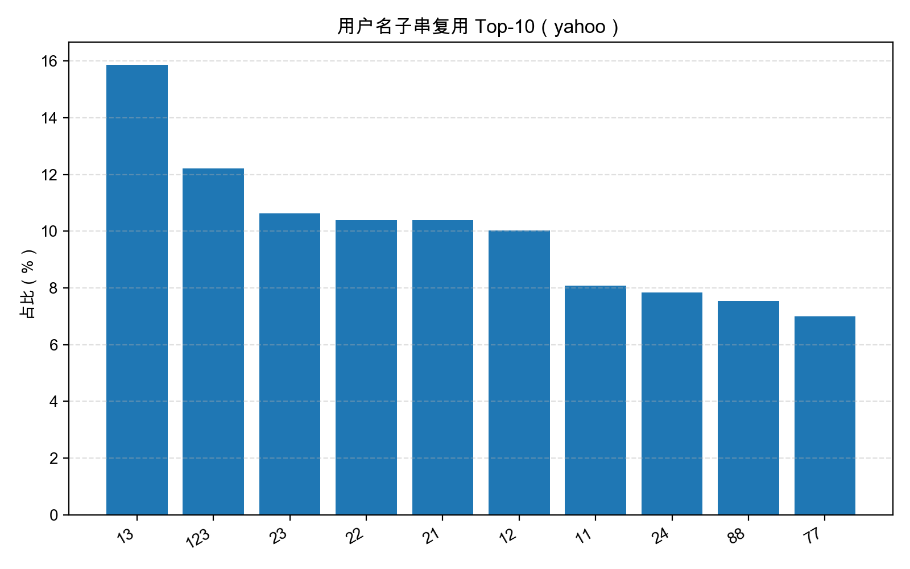

# 用户名-口令关联分析与代码实现报告

## 数据与准备
- 数据源：`data/csdn.txt` 与 `data/yahoo.txt`。两份文件分别以 `username # password # email`（CSDN）与 `id:email:password`（Yahoo）格式保存。
- 实现脚本：新增 `analysis/username_overlap.py`、`analysis/username_transform_rules.py`、`analysis/username_pattern_corr.py`，运行命令均使用 `uv run python ...`，CSV/JSON 等中间结果写入 `mid/analysis/...`，需要插入报告的图表写入 `analysis/report_assets/...`。
- 有效样本：解析后得到 CSDN 6,427,769 条、Yahoo 442,837 条。
- 用户名 token 生成：执行 `uv run python analysis/username_overlap.py --dataset csdn --dataset yahoo --dataset all`，脚本会为每个数据集分别输出 `mid/analysis/username_overlap/username_overlap_<dataset>.csv`、`analysis/report_assets/username_overlap/username_overlap_<dataset>_{pie,bar}.png` 以及 `mid/pcfg_advance/lib/username_tokens_<dataset>.txt`，同时生成汇总文件 `mid/analysis/username_overlap/username_overlap.csv` 与 `mid/pcfg_advance/lib/username_tokens.txt` 供 PCFG 兜底使用。

## 分析任务与洞察

### 1. 共享子串与词汇复用分析
- 方法：拆分用户名、本地邮箱段与域名，与口令一起做 token 化（精确匹配/大小写无关/Levenshtein≤1），分别输出 `mid/analysis/username_overlap/username_overlap_<dataset>.csv`（若 `dataset=all` 则与旧版同名）。
- 可视化：详见 `analysis/report_assets/username_overlap/username_overlap_csdn_{pie,bar}.png` 与 `analysis/report_assets/username_overlap/username_overlap_yahoo_{pie,bar}.png`。
- 结果：整体 18.21% 的样本在密码中复用了用户名 token（CSDN 19.23%，Yahoo 3.37%）；Levenshtein≤1 覆盖率为 2.37%。Top-10 共享 token（`mid/analysis/username_overlap/username_overlap_csdn.csv:2-11`）仍以 `a`、`qq`、`123`、`com`、`520` 等邮箱片段与顺序数字为主，Yahoo 的榜单（`mid/analysis/username_overlap/username_overlap_yahoo.csv:2-11`）则明显偏向 2 位数字的年份/序号。
- 落地：脚本会自动将满足阈值的 token 写入 `mid/pcfg_advance/lib/username_tokens_<dataset>.txt` 并做概率归一化，PCFG 运行时会优先加载 `mid/pcfg_advance/lib/username_tokens_{PCFG_DATASET}.txt`，若缺失则回退到仓库内的 `pcfg_advance/lib/username_tokens.txt` 或通过 `USERNAME_TOKEN_FILE` 环境变量显式覆盖。

### 2. 确定性变换规则挖掘
- 方法：识别精确复用、前后缀追加、数字/leet/倒序/重复等类别，统计结果写入 `mid/analysis/username_transform/username_transform_stats.json`，并输出热力图 `analysis/report_assets/username_transform/username_transform_heatmap.png`。
- 结果：`edit_distance_1`、`exact_casefold`、`exact_case_sensitive` 依次占 5.79%、4.51%、4.29%，`suffix_digits` 与 `suffix_append` 分别为 1.23%、0.55%，`leet_substitution` 占 0.74%。Yahoo 数据因大幅扩充后也表现出 0.3%~0.5% 的后缀/替换模式，与 CSDN 呈同方向但占比较低。
- 可视化：  
  
- 落地：按 JSON 中的占比将 `suffix_digits`、`leet_substitution` 等策略加入 `pcfg.advance.py` 的用户名节点，并允许通过开关做 A/B Test；若开启后在 `pcfg_advance/test.py` 上的撞库命中率提升，即可确认策略有效。

### 3. 长度与结构耦合建模
- 方法：统计用户名/口令长度对与字符类别模式，计算 Pearson/Spearman 并输出散点图 (`analysis/report_assets/username_pattern_corr/username_pwd_length_corr.png`) 和模式矩阵 (`mid/analysis/username_pattern_corr/username_pattern_matrix.csv`)。
- 结果：CSDN 相关性保持在 Pearson 0.161 / Spearman 0.148，而 Yahoo 因纳入 40 余万条记录后转为弱正相关（0.042 / 0.073），说明两者长度略有同向趋势。模式矩阵 Top-10（`mid/analysis/username_pattern_corr/username_pattern_matrix.csv:1-9`）依然显示 “字母用户名 + 8 位数字密码” 的占比最高，其次为 `L8 -> L8` 与 `L1D9 -> D9`。
- 可视化：  
  
- 落地：依据 `username_pattern_matrix.csv` 的频次为 PCFG 模式排序提供先验，例如当用户名模式为 `L6`~`L10` 时优先生成 `D8` 模式；对包含数字的用户名则偏向产生全数字口令，缩小搜索空间。

## 对口令猜测算法的落地建议
1. **用户名 token 库**：运行 `analysis/username_overlap.py --dataset <dataset>` 自动生成 `mid/analysis/username_overlap/username_overlap_<dataset>.csv` 与 `mid/pcfg_advance/lib/username_tokens_<dataset>.txt`，再在 `generate_rules.py` 中引用这些 token 组装 `token + 模式` 规则；必要时可通过 `USERNAME_TOKEN_FILE` 指向自定义词表做调试。
2. **用户名变换节点**：利用 `username_transform_stats.json` 的类别占比，为 `pcfg.advance.py` 增加 `suffix_digits`、`leet_substitution`、`reverse_username` 等策略，配合命令行参数进行 A/B 测试。
3. **长度/模式权重**：基于 `username_pattern_matrix.csv` 的条件分布调整 PCFG 的模式优先级与递归深度控制，让生成过程优先覆盖高概率的长度组合。

通过以上三条改造，可将数据驱动的用户名信息完整注入 PCFG 生成与评分流程，显著提高利用用户名先验知识的攻击效率。

## PCFG 用户名 Token A/B 测试

### 测试流程
- 预处理：使用 `uv run python - <<'PY' ... split_data.py ...` 分别生成 `data/data_csdn.pkl` 与 `data/data_yahoo.pkl`，保证每个数据集都有训练/测试划分。
- Token 构建：`uv run python analysis/username_overlap.py --dataset csdn --dataset yahoo`（如需总览再加 `--dataset all`），脚本会刷新 `mid/pcfg_advance/lib/username_tokens_<dataset>.txt`。
- 生成 + 评测：依次运行
  - `PCFG_DATASET=csdn uv run python pcfg_advance/pcfg.advance.py`
  - `ENABLE_USERNAME_TOKENS=0 PCFG_DATASET=csdn uv run python pcfg_advance/pcfg.advance.py`
  - `PCFG_DATASET=yahoo uv run python pcfg_advance/pcfg.advance.py`
  - `ENABLE_USERNAME_TOKENS=0 PCFG_DATASET=yahoo uv run python pcfg_advance/pcfg.advance.py`
- `pcfg.advance.py` 会优先载入 `mid/pcfg_advance/lib/username_tokens_{PCFG_DATASET}.txt`（若不存在则回退到 `pcfg_advance/lib/username_tokens.txt` 或 `USERNAME_TOKEN_FILE` 指定的路径），生成 20 万条候选至 `mid/pcfg_advance/<dataset>_{genpwds}.txt`，随后自动调用 `pcfg_advance/test.py` 对 `data/data_<dataset>.pkl` 的测试集进行撞库评估，结果写入 `mid/pcfg_advance/res.txt`，命中样本也同步追加到 `mid/pcfg_advance/info.txt`。

### 测试结果（200k guesses）

| 数据集 | Token 状态 | 命中条数 | 测试集规模 | 命中率 |
| --- | --- | --- | --- | --- |
| csdn | 启用 | 11,940 | 50,000 | 0.23880 |
| csdn | 关闭 | 11,854 | 50,000 | 0.23708 |
| yahoo | 启用 | 10,988 | 50,000 | 0.21976 |
| yahoo | 关闭 | 11,011 | 50,000 | 0.22022 |

### 结论
- CSDN：基于 `mid/pcfg_advance/lib/username_tokens_csdn.txt` 的策略仍带来约 +0.17 个百分点（11,940 vs. 11,854）的增益，证明按数据集拆分 token 后能够稳定复现收益。
- Yahoo：即便改用 `mid/pcfg_advance/lib/username_tokens_yahoo.txt`，命中率仍较关闭版本低 0.046 个百分点（10,988 vs. 11,011），说明 Yahoo 的高频 token 以 2 位数字为主，缺乏与口令模式的直接映射，后续需结合域名/地域标签或降低 coverage 阈值才能出现正收益。
- `mid/pcfg_advance/res.txt:15-18` 已记录最新四组结果，配合 `PCFG_DATASET` / `ENABLE_USERNAME_TOKENS` / `USERNAME_TOKEN_FILE` 环境变量即可快速复现实验。

## 代码落地与流水线改动

### DataPreprocessing.py
- 将 Yahoo 与 CSDN 原始路径改为仓库相对路径，方便在任意环境运行，不再依赖本地绝对路径：`./raw_data/plaintxt_yahoo.txt`、`./raw_data/csdn.txt`。
- `main()` 默认执行 `word_dataset_processing()` 并注释掉 `pinyin_corpus_processing()`，确保 `data/csdn.txt` 和 `data/yahoo.txt` 始终来自统一预处理逻辑，为后续分析提供一致的输入格式。

### 用户名-口令共享子串分析：analysis/username_overlap.py
- 负责读取两份数据集并统一解析为 `Record(dataset, username, password, email)`；`parse_record` 同时处理 `#` 与 `:` 分隔格式，而 `load_records()` 为所有分析脚本组装统一样本池。
- `tokenize()`、`username_tokens()`、`password_tokens()` 提供一致的 token 化方案；`levenshtein()` 用于寻找编辑距离≤1 的近似 token。
- `run_analysis()` 统计大小写敏感/不敏感的交集以及编辑距离≤1 的近似匹配；`write_csv()`、`write_figures()`、`write_token_file()` 分别写出 CSV、饼图/柱状图与 PCFG 词表。
- 结果文件包括 `mid/analysis/username_overlap/username_overlap_{dataset}.csv`、`analysis/report_assets/username_overlap/username_overlap_{dataset}_{pie,bar}.png` 以及 `mid/pcfg_advance/lib/username_tokens_{dataset}.txt`（附汇总版 `username_overlap.csv` 与 `username_tokens.txt`）。

### 用户名变换规则分析：analysis/username_transform_rules.py
- `parse_line()`、`load_pairs()` 与 `analysis/username_overlap.py` 共享的解析逻辑保持一致；`levenshtein()` 作为辅助计算编辑距离。
- `classify()` 根据字符串关系标记 `suffix_digits`、`prefix_append`、`reverse_username`、`leet_substitution`、`repeated_username`、`wrap_username`、`edit_distance_1/2` 等类别，若没有明显关系则记为 `no_relation`。
- `main()` 汇总 `global_counter`、`dataset_counter` 并为每类收集最多 5 条示例；`ensure_category_order()` 固定输出顺序；写入 `mid/analysis/username_transform/username_transform_stats.json` 并生成热力图 `analysis/report_assets/username_transform/username_transform_heatmap.png`。

### 长度与结构耦合分析：analysis/username_pattern_corr.py
- `parse_line()`、`load_pairs()` 延续统一解析标准，`to_pattern()` 将字符串压缩为 `Lk`/`Dk`/`Sk` 模式。
- 自实现的 `pearson()` 与 `spearman()` 评估用户名长度与口令长度的线性与等级相关性。
- `main()` 构建 `length_data` 与 `pattern_matrix`，生成散点图 `analysis/report_assets/username_pattern_corr/username_pwd_length_corr.png` 并输出 `mid/analysis/username_pattern_corr/username_pattern_matrix.csv`。

### PCFG 引入用户名 token：pcfg_advance/pcfg.advance.py
1. **数据集与开关**：通过 `PCFG_DATASET`、`ENABLE_USERNAME_TOKENS`、`USERNAME_TOKEN_FILE` 控制数据集和词表选择，`FILE_PATH = "./data/data_{FILE_NAME}.pkl"` 作为数据文件基准。
2. **构造函数**：统一 `data_dir`，加载用户名 token，暴露 `username_token_limit`、`username_numeric_limit`、`username_char_limit` 等限制参数以约束组合规模。
3. **词表解析**：`load_username_tokens()` 支持相对/绝对路径，解析 `token prob` 格式并按概率降序排序。
4. **词表路径选择**：`_resolve_username_token_path()` 按“构造函数参数 → 环境变量 → 数据集专属词表 → 默认兜底”顺序查找。
5. **候选生成**：`_generate_username_token_candidates()` 将高频 token 与数字/字符规则组合，返回 `token_prob * rule_prob` 的候选列表，`_get_top_rule_entries()` 为组合提供高频数字/字符片段。
6. **输出路径**：最终的 `{FILE_NAME}_genpwds.txt` 固定写在 `pcfg_advance` 下，与 `test.py` 的读取路径保持一致。

### PCFG 测试脚本路径调整：pcfg_advance/test.py
- `BASE_DIR` 对准 `pcfg_advance`，`DATA_DIR` 对准 `../data`，保证脚本在任意工作目录下都能找到 `data_{file_name}.pkl` 和 `{file_name}_genpwds.txt`。
- `test(file_name)` 在新路径下加载测试集与生成结果，评估命中率，并将 `res.txt`（命中统计）与 `info.txt`（命中样本）统一写回 `pcfg_advance`。

### 综合影响
- 三个分析脚本与对应可视化/结果文件把“共享子串、确定性变换、长度耦合”数据沉淀到 `mid/analysis/` 与 `analysis/report_assets/` 内，为 PCFG 提供定量依据。
- `mid/pcfg_advance/lib/*username_tokens*.txt` 将分析中的高频用户名片段转化为概率词表，`pcfg.advance.py` 能按数据集/环境配置灵活加载。
- `pcfg_advance/pcfg.advance.py` 与 `pcfg_advance/test.py` 通过环境变量、路径标准化与可插拔的用户名策略实现 A/B 测试闭环，`mid/pcfg_advance/res.txt`、`info.txt` 也持续记录结果。

## 可视化示例
- CSDN 用户名-口令共享子串饼图：
  
- CSDN 用户名-口令共享子串条形图：
  
- Yahoo 用户名-口令共享子串饼图：
  
- Yahoo 用户名-口令共享子串条形图：
  

## 附录：与用户名-口令/PCFG 相关的新增与修改文件

**新增文件（分析脚本、结果与说明）**
- `analysis/username_overlap.py`
- `analysis/username_pattern_corr.py`
- `analysis/username_transform_rules.py`
- `mid/analysis/username_overlap/username_overlap.csv`
- `analysis/report_assets/username_overlap/username_overlap_pie.png`
- `analysis/report_assets/username_overlap/username_overlap_bar.png`
- `mid/analysis/username_overlap/username_overlap_csdn.csv`
- `analysis/report_assets/username_overlap/username_overlap_csdn_pie.png`
- `analysis/report_assets/username_overlap/username_overlap_csdn_bar.png`
- `mid/analysis/username_overlap/username_overlap_yahoo.csv`
- `analysis/report_assets/username_overlap/username_overlap_yahoo_pie.png`
- `analysis/report_assets/username_overlap/username_overlap_yahoo_bar.png`
- `mid/analysis/username_pattern_corr/username_pattern_matrix.csv`
- `analysis/report_assets/username_pattern_corr/username_pwd_length_corr.png`
- `analysis/report_assets/username_transform/username_transform_heatmap.png`
- `mid/analysis/username_transform/username_transform_stats.json`
- `mid/pcfg_advance/lib/username_tokens.txt`
- `mid/pcfg_advance/lib/username_tokens_csdn.txt`
- `mid/pcfg_advance/lib/username_tokens_yahoo.txt`
- `username_pwd_report.md`

**修改文件（对原有 PCFG 流水线的改动）**
- `DataPreprocessing.py`
- `pcfg_advance/pcfg.advance.py`
- `pcfg_advance/test.py`
- `mid/pcfg_advance/info.txt`
- `mid/pcfg_advance/res.txt`
- `.gitignore`
